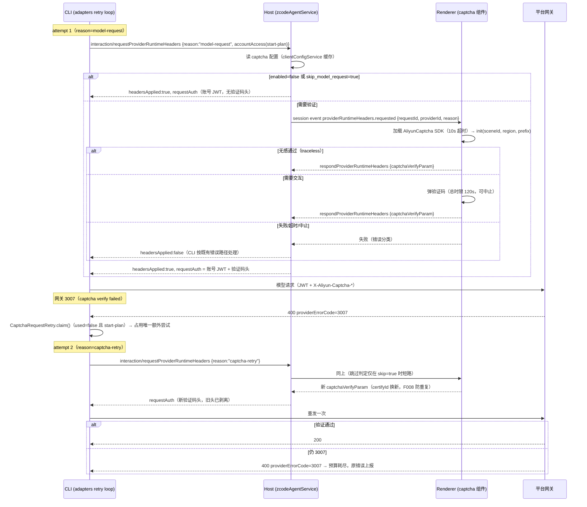

# Start Plan 模型请求验证码（captcha）门禁 spec

> 逆向依据：发行版 3.14.3/3.14.4 bundle 还原（`docs/reverse-engineering/coding-plan-quota-coefficient.md` §八）。
> 3.14.4 起服务端默认 `captcha.skip_model_request=true`，本特性在当前服务端状态下**不触发**；
> 移植目的：服务端策略回摆（skip=false）时开源版 Start Plan 可用，行为与发行版逐项对齐。

## 一、产品规则

1. 仅 **Start Plan**（`zhipu-account` 且 `mode === "start-plan"`）的模型请求参与验证码门禁；
   Coding Plan（individual/team）与 API Key 请求永不参与（发行版 `claim` 硬条件）。
2. 是否验证由服务端配置决定：`GET /api/v1/client/configs` → `data.configs.captcha`。
   - 字段：`enabled`、`region`、`sceneId`、`prefix`、`skip_model_request`。
   - `enabled === false` 或 `skip_model_request === true` → 跳过验证码，请求不带验证码头发送。
   - 配置缺失/不完整（缺 sceneId 等）→ **按发行版语义视为需验证**：Host 无法完成验证时按
     失败响应处理（`headersApplied:false`），由 CLI 侧按既有错误路径报错，不静默放行。
3. 验证通过后，模型请求携带 `X-Aliyun-Captcha-Verify-Param`（必填）与
   `X-Aliyun-Captcha-Verify-Region`（region 存在时）两个头。
4. 验证码头**单次有效**：每次物理 attempt 前刷新；合并新鉴权材料时必须剥离上一轮残留的
   两个头（发行版 3.14.4 `applyModelRequestAuth` 行为），防止旧 verify param 被复用（F008 重复提交）。
5. 网关返回 `providerErrorCode === "3007"`（`captcha verify failed`）时，允许**一次**额外
   物理重试（不占普通 retry 预算）；重试前重新走验证码刷新；第二次仍 3007 → 按原错误上报。
6. 验证参数属于敏感材料：日志/调试面对两个头按既有 sanitize 集合脱敏。

## 二、状态所有者

| 状态 | 所有者 | 说明 |
| --- | --- | --- |
| captcha 配置（enabled/skip/sceneId…） | 服务端事实；Host 经 `clientConfigService` 只读缓存 | Host 侧做 skip 判定（见「与发行版的结构差异」） |
| 重试机会（used/pending） | CLI `CaptchaRequestRetry`（每 Model 请求一个实例） | 单请求生命周期，不持久化 |
| pending runtime-headers 请求 | Host `zcodeAgentService.pendingProviderRuntimeHeaders` | 含取消与超时清理（沿用既有生命周期） |
| 验证码会话（SDK 状态/certifyId） | 渲染端 captcha 组件 | certifyId 按 provider 缓存 + F008 防重复提交 |
| 验证码头落地 | CLI `applyModelRequestAuth` | 剥离残留 → 合并本次 requestAuth.headers |

### 与发行版的结构差异（行为等价）

发行版把「skip 判定 + 配置获取」放在渲染端（`Lnn`）；开源版 Host 已拥有 pending 请求映射与
accountAccess 自动应答路径（`respondAccountRequestAuthWithoutInteraction`），因此 skip 判定
放 Host，渲染端只承担「必须弹/无感验证」的 SDK 运行。对外可观测行为（请求头、重试次数、
日志事件语义）与发行版一致。

## 三、事件顺序

失败边界：

- CLI 侧总时限 180s（既有 `PROVIDER_RUNTIME_HEADERS_TIMEOUT_MS`）；取消/超时发
  `interaction/providerRuntimeHeadersCancelled`，Host 清 pending（既有逻辑复用）。
- 渲染端 SDK 加载 10s、验证码会话 120s；中止信号沿 abort 链传播。
- Host pending 应答幂等：同 key 重复响应只生效一次（沿用 pending map 比对语义）。

## 四、接口（新增/修改）

| 层 | 接口 | 变更 |
| --- | --- | --- |
| shared | `zcodeProviderRuntimeHeadersRequestReasonSchema` | 枚举加 `"captcha-retry"` |
| contracts | `refreshRuntimeHeadersBeforeAttempt.reason` | 类型扩为 `"model-request" \| "captcha-retry"` |
| core | `ProviderRuntimeHeadersPort.refreshBeforeModelRequest.reason` | 同上 |
| adapters | `CaptchaRequestRetry`（新） | claim/takeReason/extraAttempts |
| adapters | `applyModelRequestAuth` | 合并前剥离两个残留验证码头 |
| adapters | sanitize 集合 | 加两个验证码头名 |
| services | `clientConfigService` 快照 | 暴露 `captcha` 配置（含 `skipModelRequest` 规范化） |
| services | `ZCodeAgentServiceEvent` | 加 `providerRuntimeHeaders.request` 事件 |
| services | task service | 加 `respondProviderRuntimeHeaders`（渲染端回执） |
| ui | captcha 组件（新） | SDK 加载器 + 运行器 + 诊断日志 |
| ui | 失败 UI | 3007 错误卡片加「重试（将先完成人机验证）」入口 + 中英文案 |

## 五、验收场景

> 已验证（2026-09-30）：场景 4/5 的 CLI 侧语义经 `runGenerateText` 端到端冒烟确认
> （`E:\reverse-tmp\zcode-3144\captcha-retry-smoke.mjs`）：start-plan 3007 → 恰好 2 次
> 物理尝试、第二次刷新 reason=captcha-retry 且取到新验证参数、无退避等待；
> 连续 3007 → 恰好 2 次后原错误上抛；非 start-plan → 不领取、单次失败。
> 单测：`apps/zcode-cli/packages/adapters/test/captcha-request-retry.test.ts`（7 组）、
> `packages/services/test/captchaConfigResolver.test.ts`（4 组）。

1. **skip 短路**：配置 `skip_model_request=true`（当前线上状态）→ Start Plan 请求行为与
   改动前逐字节一致：无验证码头、无渲染端交互、无新增网络调用；Coding Plan 签名链路不受影响。
2. **无感验证**：skip=false + 阿里云无感通过 → 请求自动携带验证码头，用户无感知。
3. **交互验证**：风控要求交互 → 弹验证码；通过后同一次请求继续；取消/超时 → 请求失败且
   pending 清理干净（无滞留、无重复弹窗）。
4. **3007 重试**：网关首响应 3007 → 恰好一次额外重试（总物理尝试 2 次），重试请求带新验证
   码头；重试成功 → 会话继续；重试仍 3007 → 原错误上报，不无限循环。
5. **非 Start Plan 不参与**：Coding Plan / API Key 请求即使网关异常返回 3007 也不进入
   captcha 重试（claim 条件否定）。
6. **单请求隔离**：重试机会只在单次模型请求内有效；下一个请求重新获得机会。
7. **敏感材料**：任何日志/调试面输出中验证码头取值脱敏；签名头既有脱敏不受影响。
